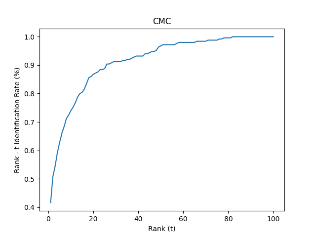

# Ear Recognition model
Model uses VGG 19 deep neural network https://keras.io/api/applications/vgg/


Model can be downloaded from
https://www.mediafire.com/file/3m94s29jyk4kue3/finnetuned_model_100e2.pt/file

put it in `./models/` folder.

## Results

CMC of the model:



## Install

```
pip install -r requirenments.txt
```

## Train

To train new model run

```
python train.py
```

## Evaluation

```
python main.py
```
